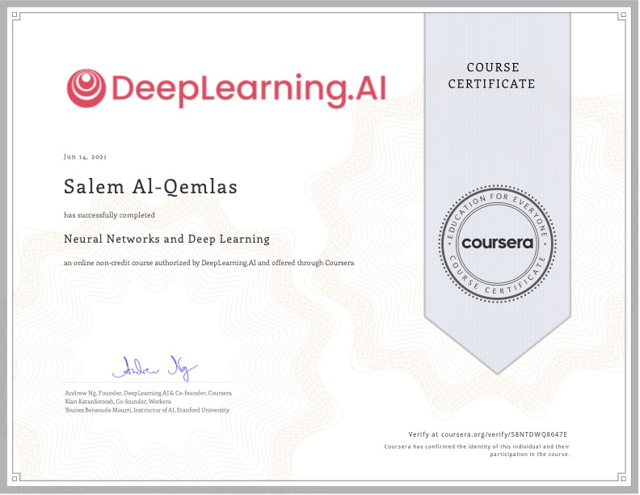
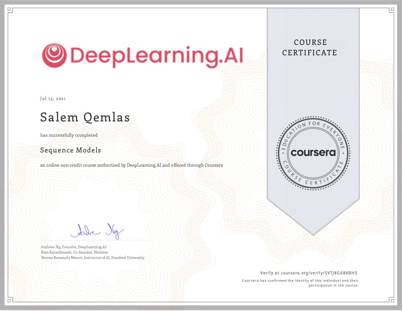

# Deep Learning Specialization on Coursera
**Master Deep Learning, and Break into AI**

- Organization: [deeplearning.ai](https://www.deeplearning.ai)
- Coursera: [Deep Learning Specialization](https://www.coursera.org/specializations/deep-learning)
- Instructor: [Andrew Ng](http://www.andrewng.org/)

## Introduction

This repo contains all my work for this specialization. All the code base and images, are taken from [Deep Learning Specialization on Coursera](https://www.coursera.org/specializations/deep-learning).

*In **five courses**, you will learn the foundations of Deep Learning, understand how to build neural networks, and learn how to lead successful machine learning projects. You will learn about Convolutional networks, RNNs, LSTM, Adam, Dropout, BatchNorm, Xavier/He initialization, and more. You will work on case studies from healthcare, autonomous driving, sign language reading, music generation, and natural language processing. You will master not only the theory, but also see how it is applied in industry. You will practice all these ideas in Python and in TensorFlow, which we will teach.*

# Course Certificate

## Research Papers Referenced
- [PAPERS.md](./PAPERS.md)

## 1. Neural Networks and Deep Learning

### Quizes

- [Week 1 - Introduction to deep learning](https://github.com/saqemlas/deep-learning-specialization/blob/main/1_NeuralNetworksAndDeepLearning/week_1/Quiz/Introduction_to_deep_learning.md)
- [Week 2 - Network Basics.md](https://github.com/saqemlas/deep-learning-specialization/blob/main/1_NeuralNetworksAndDeepLearning/week_2/Quiz/Neural_Network_Basics.md)
- [Week 3 - Shallow Neural Networks](https://github.com/saqemlas/deep-learning-specialization/blob/main/1_NeuralNetworksAndDeepLearning/week_3/Quiz/Shallow_neural_network.md)
- [Week 4 - Key concepts on Deep Neural Networks](https://github.com/saqemlas/deep-learning-specialization/blob/main/1_NeuralNetworksAndDeepLearning/week_4/Quiz/Key_concepts_on_Deep_Neural_Networks.md)

### Assignments

- [Week 2 - 
Python Basics with Numpy](https://github.com/saqemlas/deep-learning-specialization/blob/main/1_NeuralNetworksAndDeepLearning/week_2/Assignment/Python_Basics_with_Numpy.ipynb)
- [Week 2 - 
Logistic Regression with a Neural Network mindset](https://github.com/saqemlas/deep-learning-specialization/blob/main/1_NeuralNetworksAndDeepLearning/week_2/Assignment/Logistic_Regression_with_a_Neural_Network_mindset.ipynb)
- [Week 3 - Planar data classification with one hidden layer](https://github.com/saqemlas/deep-learning-specialization/blob/main/1_NeuralNetworksAndDeepLearning/week_3/Assignment/Planar_data_classification_with_onehidden_layer.ipynb)
- [Week 4 - Building your Deep Neural Network - Step by Step](https://github.com/saqemlas/deep-learning-specialization/blob/main/1_NeuralNetworksAndDeepLearning/week_4/Assignment/Building_your_Deep_Neural_Network_Step_by_Step.ipynb)
- [Week 4 - Deep Neural Network for Image Classification: Application](https://github.com/saqemlas/deep-learning-specialization/blob/main/1_NeuralNetworksAndDeepLearning/week_4/Assignment/Deep_Neural_Network_Application.ipynb)

### Lectures / Notes

- [Week 1](https://github.com/saqemlas/deep-learning-specialization/tree/main/1_NeuralNetworksAndDeepLearning/week_1/Notes) --> Introduction, NN, Why Deep learning
- [Week 2](https://github.com/saqemlas/deep-learning-specialization/tree/main/1_NeuralNetworksAndDeepLearning/week_2/Notes) --> Logistic regression, Gradient Descent, Derivatives, Vectorization, Python Broadcasting
- [Week 3](https://github.com/saqemlas/deep-learning-specialization/tree/main/1_NeuralNetworksAndDeepLearning/week_3/Notes) --> NN, Activation function, Backpropagate, Random Initialization
- [Week 4](https://github.com/saqemlas/deep-learning-specialization/tree/main/1_NeuralNetworksAndDeepLearning/week_4/Notes) --> Deep L-layer Neural network, Matrix dimension right, Why Deep representation, Building blocks of NN, Parameters vs Hyperparameters, Relationship with brain

## 2. Improving Deep Neural Networks: Hyperparameter tuning, Regularization and Optimization

### Quizes

- [Week 1 - Practical aspects of deep learning](https://github.com/saqemlas/deep-learning-specialization/blob/main/2_ImprovingDeepNeuralNetworksHyperparameterTuningRegularizationAndOptimization/week_1/Quiz/Practical_aspects_of_deep_learning.md)
- [Week 2 - Optimization algorithms](https://github.com/saqemlas/deep-learning-specialization/blob/main/2_ImprovingDeepNeuralNetworksHyperparameterTuningRegularizationAndOptimization/week_2/Quiz/Optimization_algorithms.md)
- [Week 3 - Hyperparameter tuning, Batch Normalization, Programming Frameworks](https://github.com/saqemlas/deep-learning-specialization/blob/main/2_ImprovingDeepNeuralNetworksHyperparameterTuningRegularizationAndOptimization/week_3/Quiz/Hyperparameter_tuning_Batch_Normalization_Programming_Frameworks.md)

### Assignments

- [Week 1 Initialization](https://github.com/saqemlas/deep-learning-specialization/tree/main/2_ImprovingDeepNeuralNetworksHyperparameterTuningRegularizationAndOptimization/week_1/Assignment/Initialization.ipynb)
- [Week 1 Regularization](https://github.com/saqemlas/deep-learning-specialization/tree/main/2_ImprovingDeepNeuralNetworksHyperparameterTuningRegularizationAndOptimization/week_1/Assignment/Regularization.ipynb)
- [Week 1 Gradient Checking](https://github.com/saqemlas/deep-learning-specialization/tree/main/2_ImprovingDeepNeuralNetworksHyperparameterTuningRegularizationAndOptimization/week_1/Assignment/Gradient_Checking.ipynb)
- [Week 2 Optimization Methods](https://github.com/saqemlas/deep-learning-specialization/blob/main/2_ImprovingDeepNeuralNetworksHyperparameterTuningRegularizationAndOptimization/week_2/Assignment/Optimization_methods.ipynb)
- [Week 3 TensorFlow Tutorial](https://github.com/saqemlas/deep-learning-specialization/blob/main/2_ImprovingDeepNeuralNetworksHyperparameterTuningRegularizationAndOptimization/week_3/Assignment/TensorFlow_Tutorial.ipynb)

### Lectures / Notes

- [Week 1](https://github.com/saqemlas/deep-learning-specialization/tree/main/2_ImprovingDeepNeuralNetworksHyperparameterTuningRegularizationAndOptimization/week_1/Notes) --> Train/Dev/Test set, Bias/Variance, Regularization, Why regularization, Dropout, Normalizing inputs, vanishing/exploding gradients, Gradient checking
- [Week 2](https://github.com/saqemlas/deep-learning-specialization/tree/main/2_ImprovingDeepNeuralNetworksHyperparameterTuningRegularizationAndOptimization/week_2/Notes) --> Mini-batch, Exponentially weighted average, GD with momentum, RMSProp, Adam optimizer, Learning rate decay, Local optima problem, Plateaus problem
- [Week 3](https://github.com/saqemlas/deep-learning-specialization/tree/main/2_ImprovingDeepNeuralNetworksHyperparameterTuningRegularizationAndOptimization/week_3/Notes) --> Tuning process, Picking hyperparameter, Normalizing activations, Softmax regression, Deep learning programming framework 

# 3. Structuring Machine Learning Projects

### Quizes

- [Week 1 - Bird recognition in the city of Peacetopia (case study)](https://github.com/saqemlas/deep-learning-specialization/blob/main/3_StructuringMachineLearningProjects/week_1/Quiz/Bird_recognition_in_the_city_of_Peacetopia.md)
- [Week 2 - Autonomous driving (case study)](https://github.com/saqemlas/deep-learning-specialization/blob/main/3_StructuringMachineLearningProjects/week_2/Quiz/Autonomous_driving.md)

### Lectures / Notes

- [Week 1](https://github.com/saqemlas/deep-learning-specialization/tree/main/3_StructuringMachineLearningProjects/week_1/Notes) --> Why ML Strategy?, Orthogonalization, Single number evaluation metric, Satisficing and optimizing metrics, Train/dev/test distribution, Human level performance, Avoidable bias
- [Week 2](https://github.com/saqemlas/deep-learning-specialization/tree/main/3_StructuringMachineLearningProjects/week_2/Notes) --> Error analysis, Incorrectly labeled data, Data augmentation, Transfer learning, Multitask learning, End-to-End Deep learning

# 4. Convolutional Neural Networks

### Quizes

- [Week 1 - The basics of ConvNets](https://github.com/saqemlas/deep-learning-specialization/blob/main/4_ConvolutionalNeuralNetworks/week_1/Quiz/The_basics_of_ConvNets.md)
- [Week 2 - Deep convolutional models](https://github.com/saqemlas/deep-learning-specialization/blob/main/4_ConvolutionalNeuralNetworks/week_2/Quiz/Deep_convolutional_models.md)
- [Week 3 - Detection algorithms](https://github.com/saqemlas/deep-learning-specialization/blob/main/4_ConvolutionalNeuralNetworks/week_3/Quiz/Detection_algorithms.md)
- [Week 4 - Special applications: Face recognition & Neural style transfer](https://github.com/saqemlas/deep-learning-specialization/blob/main/4_ConvolutionalNeuralNetworks/week_4/Quiz/Special_Applications:Face_Recognition_&_Neural_Style_Transfer.md)

### Assignments

- [Week 1 - Convolutional Neural Networks: Step By Step](https://github.com/saqemlas/deep-learning-specialization/blob/main/4_ConvolutionalNeuralNetworks/week_1/Assignment/Convolution_model_Step_by_Step.ipynb)
- [Week 1 - Convolutional Neural Networks: Application](https://github.com/saqemlas/deep-learning-specialization/blob/main/4_ConvolutionalNeuralNetworks/week_1/Assignment/Convolution_model_Application.ipynb)
- [Week 2 - Keras](https://github.com/saqemlas/deep-learning-specialization/blob/main/4_ConvolutionalNeuralNetworks/week_2/Assignment/Transfer_learning_with_MobileNet.ipynb)
- [Week 2 - ResNets](https://github.com/saqemlas/deep-learning-specialization/blob/main/4_ConvolutionalNeuralNetworks/week_2/Assignment/Residual_Networks.ipynb)
- [Week 3 - Car detection for Autonomous Driving](https://github.com/saqemlas/deep-learning-specialization/blob/main/4_ConvolutionalNeuralNetworks/week_3/Assignment/Autonomous_driving_application_Car_detection.ipynb)
- [Week 3 - Image Segmentation Unet](https://github.com/saqemlas/deep-learning-specialization/blob/main/4_ConvolutionalNeuralNetworks/week_3/Assignment/Image_segmentation_Unet.ipynb)
- [Week 4 - Face Recognition](https://github.com/saqemlas/deep-learning-specialization/blob/main/4_ConvolutionalNeuralNetworks/week_4/Assignment/Face_Recognition.ipynb)
- [Week 4 - Neural Style Transfer](https://github.com/saqemlas/deep-learning-specialization/blob/main/4_ConvolutionalNeuralNetworks/week_4/Assignment/Art_Generation_with_Neural_Style_Transfer.ipynb)

### Lectures / Notes

- [Week 1](https://github.com/saqemlas/deep-learning-specialization/tree/main/4_ConvolutionalNeuralNetworks/week_1/Lectures) --> Computer vision, Edge detection, Padding, Strided convolution, Convolutions over volume, Pooling layers, CNN, Why CNN?
- [Week 2](https://github.com/saqemlas/deep-learning-specialization/tree/main/4_ConvolutionalNeuralNetworks/week_2/Lectures) --> LeNet-5, AlexNet, VGG-16, ResNets, 1x1 convolutions, InceptionNet, Data augmentation
- [Week 3](https://github.com/saqemlas/deep-learning-specialization/tree/main/4_ConvolutionalNeuralNetworks/week_3/Lectures) --> Object localization, Landmark detection, Object detection, Sliding window, Bounding box prediction, Intersection over union(IOU), Non-max suppression, Anchor box, YOLO algorithm
- [Week 4](https://github.com/saqemlas/deep-learning-specialization/tree/main/4_ConvolutionalNeuralNetworks/week_4/Lectures) --> Face recognition, One-shot learning, Siamese network, Neural style transfer

# 5. Sequence Models

### Quizes

- [Week 1 - Recurrent Neural Networks](https://github.com/saqemlas/deep-learning-specialization/blob/main/5_SequenceModels/week_1/Quiz/Recurrent_Neural_Networks.md)
- [Week 2 - Natural Language Processing & Word Embeddings](https://github.com/saqemlas/deep-learning-specialization/blob/main/5_SequenceModels/week_2/Quiz/Natural_Language_Processing&Word_Embeddings.md)
- [Week 3 - Sequence models & Attention mechanism](https://github.com/saqemlas/deep-learning-specialization/blob/main/5_SequenceModels/week_3/Quiz/Sequence_models&Attention_mechanism.md)

### Assignments

- [Week 1 - Building a Recurrent Neural Network - Step by Step](https://github.com/saqemlas/deep-learning-specialization/blob/main/5_SequenceModels/week_1/Assignment/Building_a_Recurrent_Neural_Network_Step_by_Step.ipynb)
- [Week 1 - Character level language model - Dinosaurus Island](https://github.com/saqemlas/deep-learning-specialization/blob/main/5_SequenceModels/week_1/Assignment/Dinosaurus_Island_Character_level_language_model_final.ipynb)
- [Week 1 - Improvise a Jazz Solo with an LSTM Network](https://github.com/saqemlas/deep-learning-specialization/blob/main/5_SequenceModels/week_1/Assignment/Jazz_improvisation_with_LSTM/Improvise_a_Jazz_Solo_with_an_LSTM_Network.ipynb)
- [Week 2 - Word Vector Representation](https://github.com/saqemlas/deep-learning-specialization/blob/main/5_SequenceModels/week_2/Assignment/Word_Vector_Representation/Operations_on_word_vectors.ipynb)
- [Week 2 - Emojify](https://github.com/saqemlas/deep-learning-specialization/blob/main/5_SequenceModels/week_2/Assignment/Emojify.ipynb)
- [Week 3 - Machine Translation](https://github.com/saqemlas/deep-learning-specialization/blob/main/5_SequenceModels/week_3/Assignment/Neural_machine_translation_with_attention.ipynb)
- [Week 3 - Trigger word detection](https://github.com/saqemlas/deep-learning-specialization/blob/main/5_SequenceModels/week_3/Assignment/Trigger_word_detection.ipynb)

### Lectures / Notes

- [Week 1](https://github.com/saqemlas/deep-learning-specialization/tree/main/5_SequenceModels/week_1/Lectures) --> RNN, Notation, Vanishing gradient, GRU, LSTM, Bidirectional RNN, Deep RNN
- [Week 2](https://github.com/saqemlas/deep-learning-specialization/tree/main/5_SequenceModels/week_2/Lectures) --> Word representation, Word embedding, Cosine similarity, Word2Vec, Negetive sampling, GloVe words, Debiasing word
- [Week 3](https://github.com/saqemlas/deep-learning-specialization/tree/main/5_SequenceModels/week_3/Lectures) --> Beam search, Error analysis in Beam search, Bleu score, Attention model, Speech recognition

